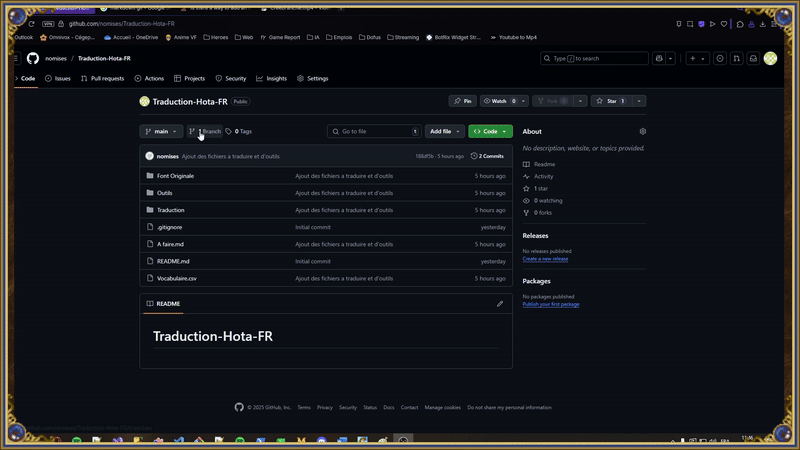
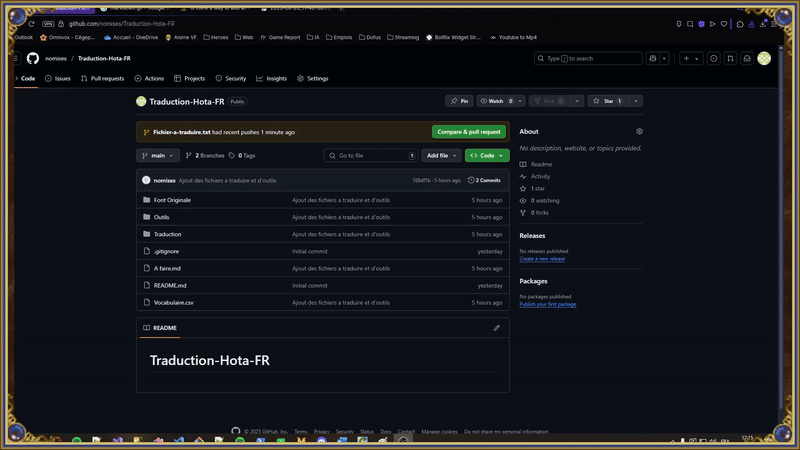

# Bienvenue sur le repository de la traduction française de HOTA

Ce projet vise à traduire en français l’extension Horn of the Abyss (HotA) pour Heroes of Might and Magic III.

# Table des matières
1. [Structure du projet](#structure-du-projet)
2. [Contribuer](#contribuer)
3. [Comment faire](#comment-faire)
    1. [GitHub](#github)
        1. [Créer une branche](#créer-une-branche)
        2. [Comment préparer votre pull request](#comment-préparer-votre-pull-request)
        3. [Comment vérifier une pull request](#comment-vérifier-une-pull-request)
    1. [Traduction](#traduction)
        1. [Maps](#maps)
        2. [Hota_dat](#hota_dat)
        3. [Hota_lng_lod](#hota_lng_lod)
        4. [Fichiers Campaign Editor et Rmg Template Editor](#fichiers-campaign-editor-et-rmg-template-editor)

## Structure du projet

* Vous pourrez retrouver un glossaire pour les mots courants dans `Glossaire.csv`, n'hésitez pas à l'étoffer lors de vos traductions.

* Le fichier `A faire.md` contient l'avancement des traductions.

* Le dossier `Outils` contient divers outils nécessaires pour certains fichiers.

* Le dossier `Traduction` contient les différents dossiers à traduire, ainsi que le dossier avec la version actuelle `HOTA_X-X-X`.

* Le dossier `Font Originale` contient les polices du jeu d'origine (**Ne sera peut-être pas utilisé**).

## Contribuer

1. Vérifiez les branches actuellement en cours.
2. Choisissez un fichier dans `A faire.md` qui n'est pas actuellement en cours de traduction.
3. Créez une branche avec le nom du fichier à traduire.
> Ex : SPTRAITS.txt
4. Respectez la structure des fichiers et la cohérence des traductions. (**N'hésitez pas à consulter le `Glossaire.csv` et à ajouter des mots si vous les jugez pertinents**)
5. Avant de faire votre pull request :
    - Barrez le fichier fait dans `A faire.md`.
    > Ex : ~~SPTRAITS.txt~~
    - Assurez-vous qu'il y a un fichier anglais lorsqu'il n'est pas déjà présent.
    - Passez votre traduction dans un correcteur, style **Antidote** ou **[IA](https://www.zerogpt.com/grammar-checker)**.

# Comment faire

## GitHub

### Créer une branche

### Comment préparer votre pull request

### Comment vérifier une pull request

## Traduction

### Maps
1. Ouvrez le fichier dans un éditeur de texte.
2. Remplacez les textes par les versions traduites.

### Hota_dat
1. Ouvrez le fichier dans un **comparateur de fichiers** comme `DiffMerge` (dans outils).
    - Faites attention à comparer avec le fichier de la version actuelle.
2. Remplacez les textes par les versions traduites.

### Hota_lng_lod
- h3c
    1. Ouvrez le fichier dans l'éditeur de campagne de votre instance d'HOTA `H3hota_cmped.exe`.
    2. "File" -> "Export Texts..."
        1. Ouvrez le fichier dans un éditeur de texte.
        2. Remplacez les textes par les versions traduites.
    3. Dans l'éditeur de campagne "Edit" -> "Scenario Properties" -> Sélectionnez la campagne voulue -> "Export"
        1. Référez-vous aux fichiers **Maps**
- txt
    1. Ouvrez le fichier dans un **comparateur de fichiers** comme `DiffMerge` (dans outils).
        - Faites attention à comparer avec le fichier de la version actuelle.
    2. Remplacez les textes par les versions traduites.

### Fichiers _**Campaign Editor**_ et _**Rmg Template Editor**_
Consultez `RMG template editor translation guide.rtf`