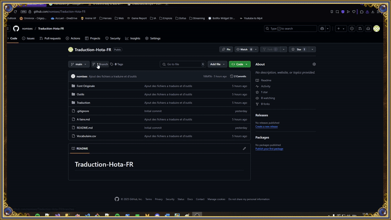
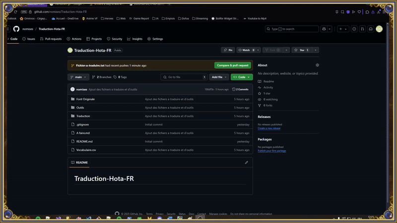

# Bienvenue sur le repository de la traduction française de HOTA

Ce projet vise à traduire en français l’extension Horn of the Abyss (HotA) pour Heroes of Might and Magic III.

# Table des matières
- [Bienvenue sur le repository de la traduction française de HOTA](#bienvenue-sur-le-repository-de-la-traduction-française-de-hota)
- [Table des matières](#table-des-matières)
  - [Structure du projet](#structure-du-projet)
  - [Contribuer](#contribuer)
- [Comment faire](#comment-faire)
  - [GitHub](#github)
    - [Comment contribuer en vidéo](#comment-contribuer-en-vidéo)
    - [Créer une branche](#créer-une-branche)
    - [Comment préparer votre pull request](#comment-préparer-votre-pull-request)
    - [Comment vérifier une pull request](#comment-vérifier-une-pull-request)
  - [Traduction](#traduction)
    - [Maps](#maps)
    - [Hota\_dat](#hota_dat)
    - [Hota\_lng\_lod](#hota_lng_lod)
    - [Fichiers _**Campaign Editor**_ et _**Rmg Template Editor**_](#fichiers-campaign-editor-et-rmg-template-editor)
  - [Erreurs connus](#erreurs-connus)
  - [Quoi faire pour démarrer une traduction](#quoi-faire-pour-démarrer-une-traduction)
  - [Quoi faire pour setup le projet lorsque la traduction est terminée](#quoi-faire-pour-setup-le-projet-lorsque-la-traduction-est-terminée)
    - [Fichiers scénario](#fichiers-scénario)
    - [Fichier Hota.txt](#fichier-hotatxt)
    - [Fichier HotA\_lng.lod](#fichier-hota_lnglod)
    - [Pour envoyer a GOG, vous pouvez suivre la documentation (ouvrir avec wordpad)](#pour-envoyer-a-gog-vous-pouvez-suivre-la-documentation-ouvrir-avec-wordpad)
    

## Structure du projet

* Vous pourrez retrouver un glossaire pour les mots courants dans [Glossaire.csv](./Glossaire.csv), n'hésitez pas à l'étoffer lors de vos traductions.

* Le fichier [A faire.md](./A%20faire.md) contient l'avancement des traductions.

* Le dossier [Outils](./Outils/) contient divers outils nécessaires pour certains fichiers.

* Le dossier [Traduction](./Traduction/) contient les différents dossiers à traduire, ainsi que le dossier avec la version actuelle `HOTA_X-X-X`.

* Le dossier [Font Originale](./Font%20Originale/) contient les polices du jeu d'origine.

## Contribuer

1. Vérifiez les branches actuellement en cours.
2. Choisissez un fichier dans `A faire.md` qui n'est pas actuellement en cours de traduction.
3. Créez une branche avec le nom du fichier à traduire.
> Ex : SPTRAITS.txt
4. Vérifier le fichier `Guide de traduction` pour connaitre les standards.
5. Respectez la structure des fichiers et la cohérence des traductions. (**N'hésitez pas à consulter le `Glossaire.csv` et à ajouter des mots si vous les jugez pertinents**)
6. Avant de faire votre pull request :
    - Barrez le fichier fait dans `A faire.md`.
    > Ex : ~~SPTRAITS.txt~~
    - Assurez-vous qu'il y a un fichier anglais lorsqu'il n'est pas déjà présent.
    - Passez votre traduction dans un correcteur, style **Antidote** ou **[IA](https://www.zerogpt.com/grammar-checker)**.

# Comment faire

## GitHub

### Comment contribuer en vidéo

### Créer une branche

### Comment préparer votre pull request

### Comment vérifier une pull request

## Traduction

### Maps
- txt
    1. Ouvrez le fichier dans un éditeur de texte.
    2. Remplacez les textes par les versions traduites.
- h3m
    1. Ouvrez le fichier dans l'éditeur de carte de votre instance d'HOTA `h3hota_maped.exe`
    2. "File" -> "Export text"
    3. Ouvrez le fichier dans un éditeur de texte.
    4. Remplacez les textes par les versions traduites.

### Hota_dat
1. Ouvrez le fichier dans un **comparateur de fichiers** comme `DiffMerge` (dans outils).
    - Faites attention à comparer avec le fichier de la version actuelle.
2. Remplacez les textes par les versions traduites.

### Hota_lng_lod
- h3c
    1. Ouvrez le fichier dans l'éditeur de campagne de votre instance d'HOTA `H3hota_cmped.exe`.
    2. "File" -> "Export Texts..."
        1. Ouvrez le fichier dans un éditeur de texte.
        2. Remplacez les textes par les versions traduites.
    3. Dans l'éditeur de campagne "Edit" -> "Scenario Properties" -> Sélectionnez la campagne voulue -> "Export"
        1. Référez-vous aux fichiers **[Maps](#maps)**
- txt
    1. Ouvrez le fichier dans un **comparateur de fichiers** comme `DiffMerge` (dans outils).
        - Faites attention à comparer avec le fichier de la version actuelle.
    2. Remplacez les textes par les versions traduites.

### Fichiers _**Campaign Editor**_ et _**Rmg Template Editor**_
Consultez `RMG template editor translation guide.rtf`

## Erreurs connus
- Les fichiers doivent être en format **AINSI** pour pouvoir fonctionné.
- Il est important que les retours de lignes correspondent aux fichiers d'origine (LF = LF / CRLF = CRLF).
  - Vous pouvez utilisé les expressions REGEX suivante pour remplacer rapidement les LF(`\n`) et CRLF(`\r\n`)
  - `\r\n` → `\n`                       Remplace les CRLF → LF
  - `}\r\n` → `}\n`                     Remplace les fins de lignes avec des brackets
  - `^\r\n` → `\n`                      Remplace les lignes vides
  - `^"\r\n` → `"\n`                    Remplace les débuts de ligne ayant des guillemets
  - `}\r\n^\n` → `}\r\n\r\n`            Remplace la ligne après un } pour un \r\n
- Certains fichiers comme le `help.txt` nécessitent une tabulation spécifique, sinon ils ne fonctionneront pas.
  - Vous pouvez faire une recherche avec l'expression REGEX `\t+` pour conparer la traduction et la version originale.
- Le Fichier Hota.txt utilise des `"` pour séparé ses sections, il est important de les gardés tel quel.

## Quoi faire pour démarrer une traduction

1. Créez un dossier dans le dossier [Traduction](./Traduction) nommé selon le numéro de version `HOTA_1-X-X`.
2. Allez récupérer le `HotA.dat` dans le dossier racine de votre instance Heroes III, habituellement `HoMM 3 Complete` et le convertir grâce au `HotA_Dat_Editor_read.bat`.
   1. Placez le résultat dans un dossier `HotA_dat` sous votre nouveau dossier `HOTA_1-X-X`.
   2. Faire un diff merge avec le fichier [HotA.txt](./Traduction/Hota_dat/HotA.txt) grâce à l'outil [DiffMerge](./Outils/DiffMerge_4_2_0_697_x64.zip) et collez les bouts de texte modifiés ou ajoutés dans le fichier de traduction.
   3. Ajoutez la tâche dans le fichier [A faire](./A%20faire.md).
3. Allez récupérer les fichiers **.txt** du `HotA_lng.lod` grâce à [MMARchive](./Outils/MMArchive.7z).
    1. Placez les fichiers dans un dossier `txt` dans `HotA_lng_lod` sous votre nouveau dossier `HOTA_1-X-X`.
    2. Faire un diff merge avec les fichiers contenus dans la version précédente grâce à l'outil [DiffMerge](./Outils/DiffMerge_4_2_0_697_x64.zip).
    3. Ajoutez les fichiers modifiés dans le fichier [A faire](./A%20faire.md).
 4. Récupérez les fichiers de campagne (h3c) du `HotA_lng.lod` grâce à [MMARchive](./Outils/MMArchive.7z).
    1. Placez les fichiers dans un dossier `h3c` dans `HotA_lng_lod` sous votre nouveau dossier `HOTA_1-X-X`.
    2. Exportez les textes des campagnes et les mettres dans le dossier [campagne_tempo_txt](./Traduction/campagne_tempo_txt/) sous un dossier avec le nom de la campagne.
    3. Ajoutez un fichier avec les valeurs non importées de l'éditeur de campagne.
    4. Ajoutez les fichiers à traduire dans le fichier [A faire](./A%20faire.md).

## Quoi faire pour setup le projet lorsque la traduction est terminée

### Fichiers scénario
- Les textes des scénarios sont exportés selon la langue configurée avec les fichiers `txt` du `HotA_lng.lod`. S'ils sont en anglais, ils doivent être importés avant de remettre ces fichiers.
- Ouvrir l'éditeur de carte d'HotA
- Ouvrir le [scénario](./Traduction/Maps/h3m/)
- Importé le [texte du scénario](./Traduction/Maps/txt/)
- Recommencé pour les différents scénario
- Ajouté les cartes dans le dossier `Maps` de votre instance Heroes III, habituellement `HoMM 3 Complete`.

### Fichier Hota.txt
- Mettre le `HotA_Dat_Editor_write.bat` et le `HotA_Dat_Editor.exe` dans le même dossier que le fichier `Hota.txt`.
- Exécutez le fichier batch.
- Mettre le résultat fichier `HotA.dat` dans le dossier racine de votre instance Heroes III, habituellement `HoMM 3 Complete`.

### Fichier HotA_lng.lod
- Ouvrir le fichier `HotA_lng.lod` dans [MMArchive](./Outils/MMArchive.7z).
- Mettre les [fonts](./Traduction/Font/).
- Mettre les campagnes traduite [d'HotA](./Traduction/HotA_lng_lod/h3c/) dans MMArchive.
- Mettre les fichiers [pcx](./Traduction/HotA_lng_lod/pcx) dans MMArchive.
- Mettre les fichiers [def](./Traduction/HotA_lng_lod/def) dans MMArchive.
- Mettre les fichiers [txt](./Traduction/HotA_lng_lod/txt) dans MMArchive.

### Pour envoyer a GOG, vous pouvez suivre la [documentation](./rsc/How%20to%20publish%20build%20on%20GOG.rtf) (ouvrir avec wordpad)

